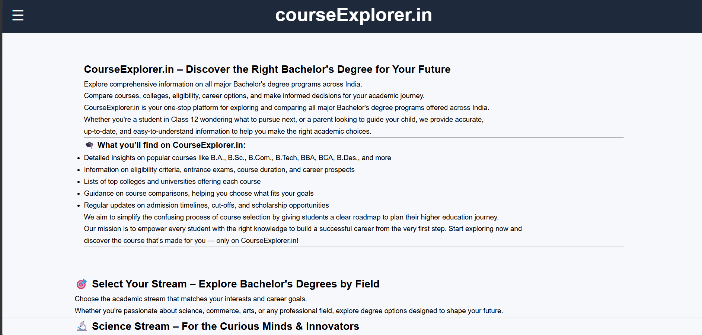
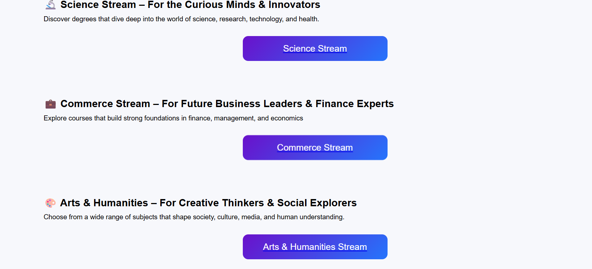
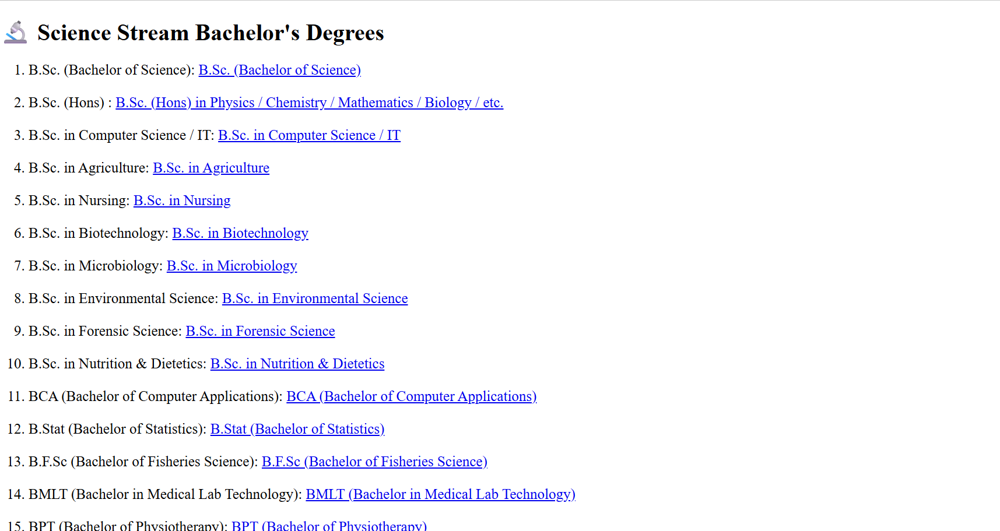
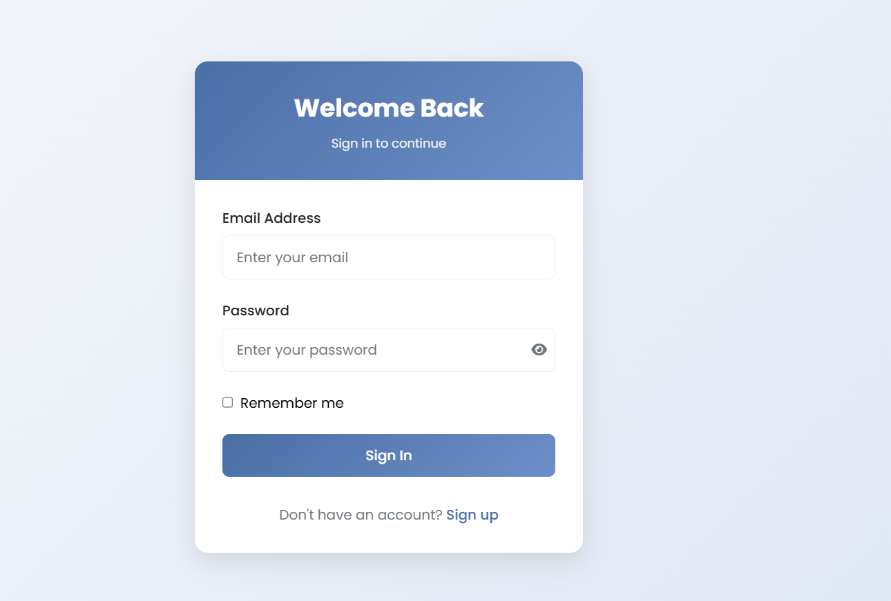

# 🚀 CourseExplorer.in

<div align="center">

# 🎓 CourseExplorer.in

### Stream-Based Course Exploration Website for Class 12 Students

<p align="center">


</p>

</div>

---

# 📖 Overview

CourseExplorer.in is a responsive educational website developed using **HTML, CSS, and JavaScript** to help students explore Bachelor's degree programs after completing Class 12.

The website categorizes degree programs into **Science**, **Commerce**, and **Arts & Humanities** streams, making it easier for students to discover suitable academic paths based on their interests.

It provides a clean, responsive interface with dedicated stream pages, authentication UI, and educational content designed to simplify career exploration.

---

## 📂 GitHub Repository

https://github.com/jeevan-kaware/course-explorer

---

# ✨ Features

## 🎓 Course Exploration

- Stream-wise Course Navigation
- Science Stream Courses
- Commerce Stream Courses
- Arts & Humanities Courses
- Degree Information
- Career Guidance Overview

---

## 📄 Website Pages

- Home Page
- Science Stream Page
- Commerce Stream Page
- Arts & Humanities Page
- About Section
- Contact Section
- Login Page (Frontend UI)
- Register Page (Frontend UI)

---

## 📱 User Experience

- Responsive Navigation Menu
- Mobile Friendly Design
- Modern User Interface
- Smooth Navigation
- Social Media Footer

---

# 🛠️ Tech Stack

| Technology | Used |
|------------|------|
| HTML5 | ✅ |
| CSS3 | ✅ |
| JavaScript | ✅ |
| Responsive Web Design | ✅ |
| Frontend Development | ✅ |

---

# 🧩 Website Structure

```text
Home Page
      ↓
Stream Selection
      ↓
Science / Commerce / Arts
      ↓
Course Information
      ↓
About & Contact
```

---

# 🎓 Available Streams

| Stream | Status |
|---------|--------|
| Science | ✅ |
| Commerce | ✅ |
| Arts & Humanities | ✅ |

---

# 📚 Science Stream Courses

Students can explore:

- B.Sc.
- B.Sc. (Honours)
- B.Sc. Computer Science
- B.Sc. Information Technology
- B.Sc. Agriculture
- B.Sc. Nursing
- B.Sc. Biotechnology
- B.Sc. Microbiology
- B.Sc. Environmental Science
- B.Sc. Forensic Science
- B.Sc. Nutrition & Dietetics
- BCA
- B.Stat
- B.F.Sc.
- BMLT
- BPT

---

# 💼 Commerce Stream Courses

Students can explore:

- B.Com
- B.Com (Honours)
- BBA
- BBM
- BFLA
- BIBF
- BMS
- BBS
- BCA (Commerce)

---

# 🎨 Arts & Humanities Courses

Students can explore:

- Bachelor of Arts (BA)
- Bachelor of Fine Arts (BFA)
- Creative Technology & Design
- Law & Professional Degrees
- Bachelor of Education (B.Ed.)

---
# 📂 Project Structure

```text
course-explorer
│
├── index.html
├── science.html
├── commerce.html
├── arts.html
├── login.html
├── signup.html
├── style.css
├── script.js
└── assets/
```

---

# 📱 Responsive Design

The website is fully responsive and optimized for:

- 💻 Desktop
- 💼 Laptop
- 📱 Mobile Devices
- 📟 Tablets

---

# 🚀 Getting Started

## 1️⃣ Clone Repository

```bash
git clone https://github.com/jeevan-kaware/course-explorer.git
```

```bash
cd course-explorer
```

---

## 2️⃣ Run the Project

Simply open the following file in your preferred web browser:

```text
index.html
```

No additional installation or dependencies are required.

---

# 📸 Screenshots

The following screenshots showcase the core pages and user interface of the website.

---

## 🏠 Home Page



---

## 🎓 Course Categories



---

## 🔬 Science Stream Page



---

## 👤 Login Page



---

# 🚀 Future Improvements

The project can be extended with the following features:

- Backend Integration using Spring Boot
- User Authentication & Authorization
- PostgreSQL Database Integration
- Search Functionality
- Course Filtering
- Student Dashboard
- Admin Dashboard
- User Profiles
- Favorite Courses
- AI-Based Career Recommendation System
- Online Admission Portal
- Course Comparison Feature
- Career Guidance Chatbot

---

# 💡 Learning Outcomes

This project helped me strengthen my understanding of:

- HTML5
- CSS3
- JavaScript
- Responsive Web Design
- User Interface Design
- Website Navigation
- Frontend Development
- Mobile-First Design
- Website Structure & Layout
- Educational Website Development

---
# 👨‍💻 Author

**Jeevan Kaware**

Frontend Developer | Java Backend Developer

**GitHub**

https://github.com/jeevan-kaware/course-explorer.git

**LinkedIn**

https://www.linkedin.com/in/jeevan-kaware-080643355/

**Portfolio**

https://smart-portfolio-kappa-eight.vercel.app/

---

# ⭐ If You Like This Project

If you found this project useful, consider giving it a ⭐ on GitHub.

Your support motivates me to continue building more educational and professional web applications.

---

# 🤝 Contributing

Contributions, suggestions, and improvements are always welcome.

If you have ideas to enhance this project, feel free to:

- Fork the repository
- Create a new feature branch
- Commit your changes
- Submit a Pull Request

---

# 📄 License

This project is developed for **learning and educational purposes**.

Feel free to use, modify, and extend it for personal learning and academic projects.

---

<div align="center">

## 🎓 Built with HTML, CSS & JavaScript ❤️

### Helping Students Explore Better Career Opportunities

**Thank you for visiting this repository. Happy Learning! 🚀**

</div>
